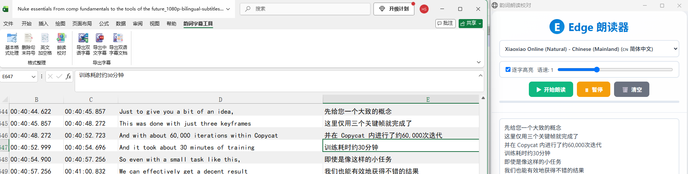
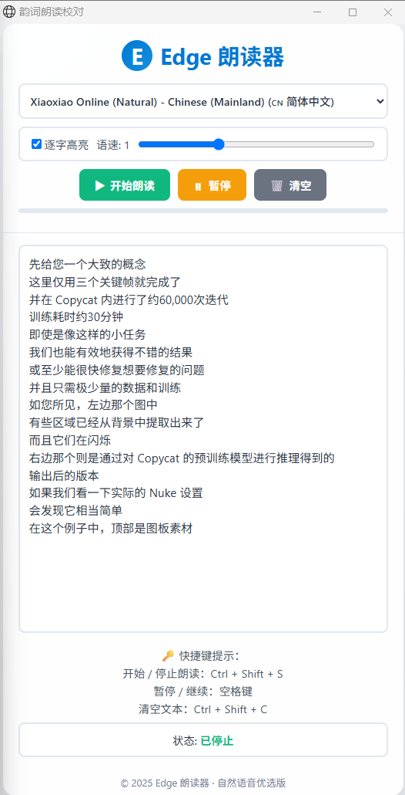
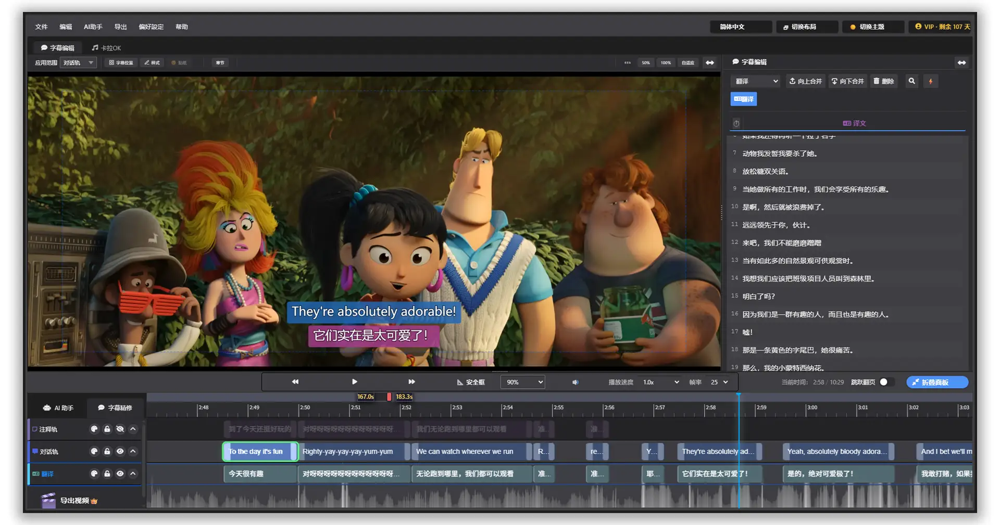

# 韵词字幕 · Excel 字幕工具箱

[English](README.en.md) | 简体中文

> 在 Excel 里就能完成字幕整理、格式清洗、朗读校对、导出 SRT——
> 免费、开源，做完之后一键拖进 [韵词字幕](https://shinesoft.cn/zh-CN/)，
> 接着做时间轴精修和卡拉OK 特效制作。



---

## 目录

- [1. 功能介绍](#1-功能介绍)
  - [1.1 为何做这个项目](#11-为何做这个项目)
  - [1.2 解决了什么问题](#12-解决了什么问题)
  - [1.3 具体功能一览](#13-具体功能一览)
- [2. 安装方法](#2-安装方法)
- [3. 关于韵词字幕 / 开发团队](#3-关于韵词字幕--开发团队)

---

## 1. 功能介绍

### 1.1 为何做这个项目

这个工具箱最早只是团队内部为了配合 [韵词字幕](https://shinesoft.cn/zh-CN/)
自用的小脚本——一份处理字幕的 Excel VBA 宏。用得久了发现，字幕组和译制
团队日常整理台本、核对双语文本这类工作，大部分时间其实是在 Excel 这类最
基础的办公软件里完成的：贴文本、对时间轴、挑错字、读一遍听感对不对。
与其让大家各自维护一份不同版本的宏文件，不如做成一个统一的、谁都能装的
加载项，顺手也开源出来，需要的人可以直接用，也欢迎照着改成自己需要的样子。

### 1.2 解决了什么问题

字幕/台本整理阶段，几个反复出现的麻烦事：

- **中英文混排格式乱**：中英文之间要不要空格、标点全半角混用、句末标点
  该留不该留，手动一条条改很费时间
- **听感校对靠自己念**：文本改完了，语气、断句、有没有漏字漏词，光看文字
  容易漏掉问题，请人朗读或者自己念一遍又很打断工作节奏
- **格式转换繁琐**：Excel 里整理好的双语文本，转成标准 SRT 字幕文件、
  或者导出成 Word 校对稿，纯手工敲很容易出错

### 1.3 具体功能一览

功能区新增"韵词字幕工具"选项卡：


| 分组 | 功能 | 说明 |
|---|---|---|
| 格式整理 | 基本格式处理 | 一键设置表头底色、隔行底纹、统一时间列格式、清理空格与首字母大小写 |
| 格式整理 | 删除句末符号 | 清理句末多余标点，问号感叹号会保留 |
| 格式整理 | 英文加空格 | 自动在中英文/数字/符号之间插入或去除空格 |
| 格式整理 | 朗读校对 | 选中文字，调用 Edge 自然语音朗读，自动开始，不用点第二下 |
| 导出字幕 | 导出双语字幕 | 按 序号/开始时间/结束时间/英文/中文 的列结构导出 SRT |
| 导出字幕 | 导出中文字幕 | 仅导出中文部分为 SRT |
| 导出字幕 | 导出双语字幕文档 | 导出为 Word 文档，方便传阅校对 |

**朗读校对效果预览**



朗读校对调用的是系统里真正的 Microsoft Edge（Chromium 内核），用的是 Edge
的自然语音，不是老式机械音；窗口会贴靠在屏幕右侧、撑满屏幕高度，视觉上接近
一个侧边栏，选中文字点一下就自动开始念，读完再选一段新文字，会直接替换掉
继续念，不用关了重开。

---

## 2. 安装方法

### 方式一：用 PowerShell 脚本一键安装（推荐）

按 [`docs/01-Excel打包指南.md`](docs/01-Excel打包指南.md) 把源码打包成
`ExcelToSRT.xlam`，配合 `reader.html` 和 `install/` 目录下的脚本安装：

```powershell
# 右键 install-excel.ps1 → "使用 PowerShell 运行"
# 或者命令行：
powershell -ExecutionPolicy Bypass -File .\install-excel.ps1
```

装好之后重新打开 Excel，功能区会自动出现"韵词字幕工具"选项卡，以后每次
打开都会自动加载，不用再手动设置。

卸载跑 `uninstall-excel.ps1` 即可，全程只操作当前 Windows 账户，不需要
管理员权限，干净卸载不留残留。

详细步骤看 [`docs/03-PowerShell使用指南.md`](docs/03-PowerShell使用指南.md)。


### 方式二：自己从源码打包（适合想改代码的人）

源码在 `excel-addin/` 目录下，跟着 [`docs/01-Excel打包指南.md`](docs/01-Excel打包指南.md)
从零打包，指南里包含详细的图标插入步骤和 Ribbon XML 配置方法。

---

## 3. 关于韵词字幕 / 开发团队

这个工具箱由 **韵词字幕** 团队开发和维护。

**韵词字幕**是一款 AI 驱动的字幕制作软件，覆盖从**语音转字幕 → 翻译 →
精修 → 卡拉OK 特效 → 导出成片**的完整流程：

- AI 转录、时间轴自动对齐、19+ 语言联网翻译
- 多轨道字幕 + 音频波形图联动、CPS 机制、毫秒级精度调节
- 50+ 卡拉OK 动态特效预设，K-Cut 智能音节切割
- 支持 MP4/MKV/MOV 以及 SRT/ASS/WebVTT/Word/Excel 等 10+ 种格式导出



- 🌐 官网：https://shinesoft.cn/zh-CN/
- 📥 免费下载：https://shinesoft.cn/zh-CN/download/
- 📖 教程与案例中心：https://shinesoft.cn/zh-CN/case-study/

这个 Excel 工具箱定位是"整理阶段的辅助工具"——把 Excel 里能做的前期
文字工作做顺手，导出的 SRT 可以直接拖进韵词字幕，接上后续的时间轴精修
和特效制作。

---

## 🙌 欢迎交流 / 贡献

用的过程中遇到问题、有新想法，欢迎在 [Issues](../../issues) 里提，或者
直接 Fork 改了发 Pull Request。如果这个工具帮到了你，也欢迎去
[官网](https://shinesoft.cn/zh-CN/) 看看韵词字幕本体，顺手点个 Star ⭐。

## License

MIT，欢迎自由使用、修改、二次分发。
